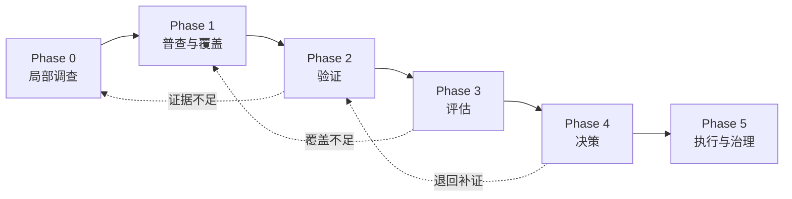

# 00 方法论边界与阶段门

这套方法论用于在声明的代码、运行环境和时间窗口内，逐步建立对存量系统的可追溯认识，并在证据足够时辅助评估与改造决策。它不承诺“自动读懂全部系统”，也不把局部源码分析直接升格为运行时事实、业务真相或重构立项依据。

## 一、适用边界

适用场景：

- 接手缺少可信文档的存量系统；
- 定位一条请求、任务、消息或数据写入链路；
- 建立仓库、入口、资产和跨系统边的声明分母；
- 组合历史、运行与业务信号，筛选值得继续验证的风险或改造候选；
- 在已授权的改造中建立可观测、可回退、可防回归的小步迁移。

不适用于：

- 仅凭仓库命名推断业务语义；
- 在没有声明分母和观察窗口时证明“不存在”；
- 用单一热点分、日志数或作者分布自动产生重构优先级；
- 绕过业务负责人、安全审批、测试、发布和回退决策；
- 把外部案例的组织和技术解法原样复制到不同环境。

## 二、六个阶段

| 阶段 | 主要输入 | 主要产物 | 允许得出 | 禁止越界 | 退出条件 |
|---|---|---|---|---|---|
| Phase 0 局部调查 | 一个有边界的问题、workspace、可选起点 | Claim、源码引用、候选链路、未决项 | 在指定 commit 上源码如何组织 | 宣称系统全量覆盖、线上必然执行或业务含义已确认 | 主问题收敛；关键源码 Claim 有引用；运行与业务未知被显式标注 |
| Phase 1 普查与覆盖 | 仓库/服务声明清单、扫描器、环境范围 | `repos.yaml`、`entries.yaml`、资产清单、`coverage-ledger.yaml` | 在声明分母和扫描能力内的覆盖状况 | 把未观察项判为不存在 | 分母、扫描器、差异、未知来源和覆盖率均可审计 |
| Phase 2 验证 | Phase 0/1 候选、可运行环境、日志/调试/trace | 追踪记录、建构输出、运行观察、反证 | 特定环境和窗口中观察到的行为 | 把测试或采样未覆盖解释为不可达 | 关键路径的证据类型、环境、时间窗口和局限已记录 |
| Phase 3 评估 | 普查结果、运行观察、Git/工单/故障数据 | 热点、变更耦合、错误信号、暴露度、所有权集中度 | 值得继续验证的风险与候选 | 用单一代理指标自动排定重构顺序 | 原始分子、归一化口径、数据窗口、过滤规则和不确定性完整 |
| Phase 4 决策 | 至少两个独立信号、需求信号、指标基线 | 重构提案、裁决记录 | 是否值得立项和要验证的收益假设 | 在业务语义待定或收益无基线时直接迁移 | 三道证据门槛通过；决策人和日期可审计 |
| Phase 5 执行与治理 | 已批准提案、readiness 检查、发布权限 | 小步变更、发布/回退记录、观测指标、CI 棘轮 | 改造是否达到目标 | readiness 未通过时进入生产迁移 | 指标达标或触发停止/回退条件；地图与规则已回填 |

## 三、三档采用方式

| 档位 | 包含阶段 | 适合的问题 | 默认停止点 |
|---|---|---|---|
| 快速调查 | Phase 0 | “这个按钮后面怎么走”“这个异常从哪里来” | 形成可核验的局部报告和下一步验证项 |
| 标准评估 | Phase 0–3 | “哪些模块值得深入”“风险集中在哪里” | 输出候选和不确定性，不直接立项 |
| 完整改造 | Phase 0–5 | 已有持续投入、运行数据、决策人和发布权限的改造计划 | 指标验证完成并建立防回归治理 |

不是每个项目都需要进入 Phase 4–5。默认从快速调查或标准评估开始，只在决策问题和组织权限明确时升级。

## 四、证据语义和兼容规则

技术证据类型表示“这条 Claim 由什么支持”，不是全局置信度排名：

| 类型 | 可支持的典型 Claim | 必备元数据 | 不能单独推出 |
|---|---|---|---|
| `source-verified` | 特定 commit 的文件、声明、条件和静态边 | commit + file:line/配置引用 | 目标环境已启用或实际执行 |
| `build-verified` | 指定配置可构建、解析或装配 | 命令、配置、环境和原始输出 | 线上流量经过该路径 |
| `test-observed` | 测试/本地调试中实际发生的调用与输出 | 测试标识、环境、时间、原始输出 | 未覆盖路径不存在 |
| `runtime-observed` | 声明的非生产运行环境中的观测 | 环境、部署版本、时间窗口、采样和原始数据 | 生产环境行为相同 |
| `production-observed` | 生产观察窗口中出现的行为与分布 | 服务版本、时间窗口、采样率、聚合口径 | 观察窗口外永远不会发生 |
| `inferred` | 由命名、结构、代理指标或部分边推导的候选 | 推理根据 + 验证方法 | 可作为事实进入决策 |
| `unverified` | 尚无可验证支持 | 未知点 + 下一步 | 任何确定性结论 |

业务证据是正交的第二轴：`pending` / `business-confirmed` / `disputed` / `stale`。确认记录必须包含确认人、日期、适用范围和复查日期；多个权威来源不一致时标为 `disputed`，不得折叠成单一真相。

兼容规则：

- 历史 `verified` 默认映射为 `source-verified`，除非同一产物附有可审计的构建或运行记录；
- `inferred` 和 `unverified` 含义保持不变；
- 旧产物仍可读，新产物不再写出未限定的 `verified`；
- Code Loop 当前模型保持兼容，其 `verified` 在方法论中只按 `source-verified` 解读。

### 负面证据铁律

“未扫到”“未采样到”“未在测试中执行”默认不能推出“不存在”或“不可达”。只有在以下信息同时存在时，才能得出限定范围的负面结论：

1. 声明且稳定的分母；
2. 可复现的扫描或观察方法；
3. 明确的仓库、环境和配置范围；
4. 对时间敏感的结论附有观察窗口；
5. 已知盲区和采样局限已公开。

## 五、代理指标约束

`error-signal density`、`ownership concentration proxy`、`reachability-weighted exposure estimate` 和 `change-coupling signal` 都是调查排序信号，不是缺陷真值、bus factor、真实执行热度或架构边界真相。任何代理指标产物必须同时保存：

- 原始分子和可用分母；
- 归一化方式；
- 数据窗口和时间衰减；
- 过滤规则与排除项；
- 数据来源偏差和不确定性；
- 下一步交叉验证手段。

重构候选至少需要两个来自不同数据生成机制的信号，例如“Git 变更信号 + 工单/故障数据”，而不是同一份 Git 数据的两个衍生分数。

## 六、三道证据门槛与 readiness

重构提案继续使用三道立项门槛：

1. **技术问题**：有适配 Claim 的证据类型，并有至少两个独立信号；
2. **业务/需求相关性**：涉及业务含义时已 `business-confirmed`，并有历史或未来需求信号；
3. **可测量收益**：收益假设绑定基线、目标值和观察窗口。

通过三道门槛表示“值得立项”，不表示“已可生产迁移”。生产迁移前必须另行通过 readiness：负责人与干系人、行为 Oracle/表征测试、可观测性、发布与回退、数据迁移、安全隐私、停止条件。readiness 未通过时可批准原型和补证，不得开始生产迁移。

## 七、产物合同

每份机器生成或人机共同维护的长期产物都必须回答：

- 它覆盖哪些仓库、commit、配置和环境？
- 由什么工具和规则生成？
- 数据窗口和采样是什么？
- 证据可以支持什么，不能支持什么？
- 谁维护，什么情况下过期？
- 人工段与机器段的覆盖规则是什么？

YAML/Markdown 产物内联或引用 `artifact-metadata.yaml`；CSV 通过同名 `.metadata.yaml` 侧车文件记录元数据。stable ID 必须有别名和 lineage 机制，文件移动、拆分和跨仓迁移时不得靠新路径静默替换旧 ID。

## 八、Code Loop 的位置

Code Loop 是 Phase 0 的交互式源码证据导航器和假设整理器。它的完成条件是：

- 一个主调查问题已收敛；
- 关键静态 Claim 有 file:line 证据；
- 运行时和业务语义不确定性被显式标注；
- 多问题已拆分为调查议程；
- 产出可交接的初步报告和下一步验证项。

Code Loop 不宣称入口或资产普查完成，不自动写入 glossary/entries 等长期人工事实源，不给出重构优先级，也不替代 Phase 2 的运行验证。其当前 `verified` 按本文兼容规则解读为 `source-verified`。

## 九、一个最小交接例子

1. Phase 0 发现 `OrderController#create` 调用 `OrderService#create`，标为 `source-verified`；“所有创建订单流量都经过这里”仍为 `unverified`。
2. Phase 1 将 HTTP、MQ、定时任务和外部调度平台纳入覆盖账本，发现还有一个批量创建入口。
3. Phase 2 在测试环境验证两个入口，保存原始日志，标为 `test-observed`；生产占比仍不可推断。
4. Phase 3 发现该模块同时具有高 change-coupling signal 和工单回归信号，将其列为候选。
5. Phase 4 核对业务语义、需求趋势和基线，判断是否立项。
6. Phase 5 只在 readiness 完成后通过可回退步骤执行，并把新证据回填地图。
