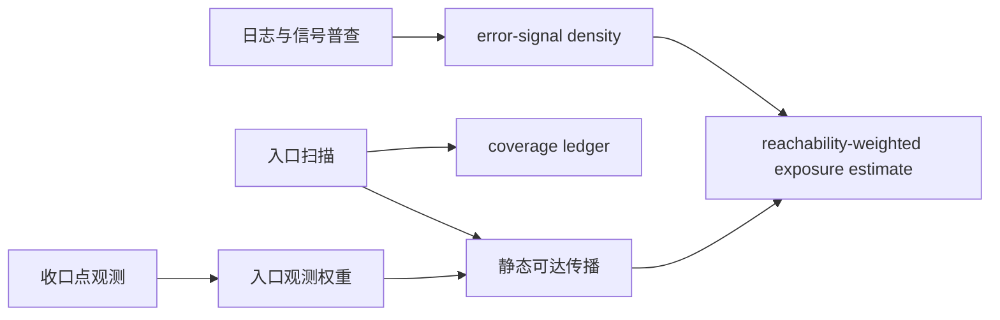

# 01 建图方法论：候选骨架、覆盖账本与运行校准

本篇适用于 Phase 0–2：先形成局部源码候选，再建立声明范围内的覆盖账本，最后用构建、测试或运行观察校准。输入是有边界的问题、仓库清单、扫描器能力和可用环境；产物是候选地图、`entries.yaml`、`coverage-ledger.yaml` 与追踪记录。

## 一、静态地图是候选骨架

让 Agent 先产出三种有限地图：仓库/模块边界、关键目录、围绕一个请求/SQL/任务的候选旅程。每个节点和边必须带 stable ID、commit、file:line 和证据类型。

- 源码直接声明的边可标 `source-verified`；
- 由命名、反射目标或约定推断的边标 `inferred`；
- 不知道如何验证的断点标 `unverified` 并附验证任务。

静态扫描只能证明“在指定 commit 和扫描器能力内发现了什么”，不能证明路径在目标环境启用、被流量经过，或扫描结果覆盖了全部系统。

## 二、用覆盖账本替代“静态完备”

Phase 1 先声明分母：仓库、入口种类、配置、环境和时间窗口，再记录每种发现方法的能力与盲区。`coverage-ledger.yaml` 对账：

1. 声明分母；
2. 静态发现；
3. 指定环境中的运行观察；
4. 匹配项、static-only、runtime-only；
5. 未知来源、覆盖率公式和后续验证任务。

HTTP 注解、`@Scheduled`、MQ consumer 等通常可枚举，但自研注册、条件 Bean、外部调度平台和动态路由会突破扫描器边界。因此只能说“在声明扫描器、仓库范围、运行环境和观察窗口内完成对账”。

## 三、运行信号的正确用途

可利用的信号包括 access log、APM trace、业务日志、慢查询、异常堆栈、类加载记录和 profiler 样本。它们必须记录环境、部署版本、窗口、采样率、过滤与聚合口径。

- error 日志聚类产生 `error-signal density`，不是缺陷真值；日志缺失、级别习惯和重复打印都会造成偏差。
- JFR、async-profiler、eBPF profiler 提供采样观察，不等同于代码覆盖率；未采到某方法不能证明它未执行。
- 类加载或 profiler 长窗口未出现的代码只能进入“未观察/死代码候选”。删除前仍需引用扫描、构建/测试、目标环境观察和负责人确认。

## 四、logs-only 的四步走

1. 静态盘点日志模板和关联键；
2. 扫描入口并写入覆盖账本；
3. 在获批的 web/RPC/调度/MQ 收口点增加结构化观测，明确隐私和回滚；
4. 用入口权重沿静态图传播，输出 `reachability-weighted exposure estimate`。

传播结果受分支、反射、异步和动态分发影响，只能用于调查排序。要进入 Phase 3，必须保留原始入口权重、传播算法、窗口、图断点和不确定性。

## 五、tracing 与验证

自动埋点可降低标准库和框架边的接入成本，但不能保证覆盖业务内部、自定义协议或动态上下文；业务键和关键边仍可能需要手工埋点。tracing 不是 Phase 0 的前置条件，也不应以“先建全链路”为由阻塞局部调查。

Phase 2 对关键 Claim 选择适配手段：

- 构建/配置装配：`build-verified`；
- 测试或本地调试：`test-observed`；
- 非生产环境观测：`runtime-observed`；
- 生产窗口观测：`production-observed`。

Observed 类型必须保留原始记录和适用范围。一次测试、一次 trace 或一个采样窗口不能推出未覆盖路径不存在。

## 六、人机分工与阶段门

确定性扫描器维护分母、发现项和差异；LLM 组织候选链路、解释断点并提出验证任务；人决定调查范围、环境权限和风险优先级。

进入下一阶段前：Phase 0 需收敛主问题和静态 Claim；Phase 1 需明确分母、覆盖方法和未知项；Phase 2 需记录环境、commit/版本、时间窗口、获取方式、新鲜度和局限。维护人由 `artifact-metadata.yaml` 指定；commit、配置、部署版本或过期条件变化时产物标记 stale 并复查。
