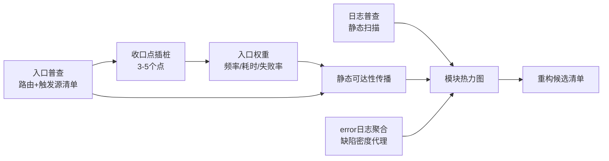

# 01 建图方法论：静态骨架 + 运行时加权

核心主张：**没有流量数据的代码地图就像没有车流量的街道图——结构对了但优先级是瞎的。** 地图必须由两部分构成：静态分析给出完备的骨架，运行时数据给骨架加权。只有加权之后，才能在巨大的系统中知道哪些部分值得优先定位。

## 一、静态骨架：三张图

让 Agent 第一件事不是"解释这个项目"，而是产出三张图：

1. **仓库/模块边界图**：每个仓库或模块的用途、语言、构建系统、上下游关系。多仓库时先画仓库间边界，再画仓库内部。
2. **关键目录图**：每个模块不超过 10 个重要目录。生成代码、vendored 依赖、fixture、构建产物一律提前过滤，除非它们就是学习目标。
3. **端到端旅程图**：一条可观察请求（一个 HTTP 请求 / 一条 SQL / 一个 CLI 命令）从入口到出口的路径。

第三张图是控制认知负担的关键：**以流为锚点而不是以文件为锚点**。用户行为的组合是无穷的，但一条具体旅程的主路径是有限的；围绕旅程读代码，无关的 80% 自然被排除在外。

每张图上的论断都必须带证据等级（见 [02-证据体系.md](02-证据体系.md)）：从本地文件确认的标 verified，从命名推断的标 inferred，没验证的标 unverified。证据不足时不强行画旅程图，标为候选路径并写明下一步验证手段。

## 二、运行时加权：先榨干已有信号，再谈补埋点

存量系统补埋点的成本和风险都不低，而大多数系统已经躺着几类可挖的数据，**不用改一行业务代码**：

- 网关 / access log：哪些接口真的有量；
- APM trace（如果有）：真实调用链；
- 业务日志：前人留下的考古地层，error 日志密集处就是历史上反复出问题的地方，可直接当缺陷密度的代理指标；
- DB 慢查询日志：数据访问的热点和痛点；
- 异常堆栈聚合：高频故障路径。

这些数据足以回答"哪 20% 的代码承载了 95% 的流量"。挖掘现有日志本身就是一个高杠杆的工具化方向（见 [04-工具箱设计.md](04-工具箱设计.md) 的 T3）。

**生产环境代码覆盖率是被低估的手段。** 用采样式 profiler（JVM 上 JFR / async-profiler，或 eBPF 这类无侵入手段）在生产跑一段时间，直接得到"哪些代码真的被执行、频率如何"。副产品极有价值：**连续几个月从未被加载/执行的代码就是死代码候选**。删除死代码往往是存量系统 ROI 最高的"重构"——先把地图上根本不存在的街道擦掉，剩下的图才好看。

## 三、后台/定时任务：入口有限可枚举，比用户链路更好处理

用户行为的组合是无穷的，但**后台触发源是有限的、且必然在某处注册**。分两步走：

**第一步，静态建触发源清单（trigger inventory）。** 定时任务一定注册在某处：crontab、Quartz/xxl-job 配置、`@Scheduled` 注解、k8s CronJob manifest；MQ 消费一定有 topic 订阅和 consumer 注册；事件监听、webhook 回调同理。全部可 grep / 可解析，AI 做这个盘点又快又准。产出一张表：触发源 → 入口函数（file:line）→ 声称的用途。这张表是**完备的**——不像用户链路只能覆盖典型场景，因为注册机制就那么几种。

**第二步，运行时数据只需要在分发点打一次。** 不需要给每个任务埋点：定时框架和 MQ 消费通常收口在一两个框架边界（调度器的 dispatch、consumer 的基类/拦截器）。在这一个点加结构化日志或指标，一次性拿到**所有**任务的执行频率、耗时、失败率。调度平台本身往往还有现成的执行历史可直接导出。这比给用户链路补埋点便宜一个数量级。

有了"完备清单 + 执行权重"，后台部分的地图往往比前台先完成。

## 四、logs-only 状态的四步走

"只有分散日志、没有 tracing"是存量系统最常见的状态。此时的关键主张：**不要为了分析先去建全链路 tracing——那是季度级工程，会把分析卡死。用"入口权重 + 静态传播"逼近 tracing 的效果，成本是天级的。**

**第一步：日志普查（纯静态）。** AI 扫描代码里全部日志语句，产出清单：哪个模块在什么位置打了什么日志、有没有可用的关联键。订单号、用户 ID 这类业务 ID 往往可以当穷人版 trace ID 用。同时盘点线上日志文件的实际位置和格式。

**第二步：入口普查（纯静态，完备）。** HTTP 路由表 + 后台触发源清单。这张表是地图的骨架。

**第三步：只在收口点插桩，不做全链路。** Web 框架的 filter/中间件、RPC 客户端拦截器、调度分发点、MQ consumer 基类——一个系统通常只有三五个这样的收口点。每个点加一条结构化日志（入口名、耗时、成功失败），改动极小、风险极低，但一次性拿到所有入口的频率、耗时、失败率。

**第四步：静态可达性传播，合成热力图。** 入口的运行时权重 + 静态调用图（从入口向下追可达代码），把入口流量"传播"到模块和函数层面。它不如真 tracing 精确——分支、动态分发会引入误差——但给地图加权、排重构优先级足够了。**误差大的地方恰恰是值得人工或加日志重点验证的地方**，这又回到了证据等级体系。

## 五、tracing 的定位：自动埋点尽早上，手动埋点随重构生长

"tracing 不是分析的前置条件"针对的是**手工全链路埋点**——那是季度级工程，会把分析卡死。但 Java 栈有零代码的自动埋点方案（OTel Java Agent，周级成本），应该尽早上；业务级的手动埋点（业务键进 span attributes）则放在绞杀者模式替换链路时顺手做，让可观测性随重构增量生长。方案选型与落地路径见 [06-分布式与Dubbo.md](06-分布式与Dubbo.md) 第五节。

## 六、验证：用运行时证据校准静态阅读

静态读代码得到的调用链是"源码推演"，跑起来打断点/加日志得到的才是事实。很多重构决策的错误源于"以为这段代码在这个场景下会执行，实际不会"。对关键路径：

- 建一个最小可运行环境——哪怕只是一个组件 + 一条最小请求，不追求全系统启动；
- 用真实输出（日志行、断点变量、HTTP 响应）验证调用链；
- 追踪记录按证据等级标注：真实调试追踪 > 日志插桩追踪 > 纯源码推演，推演出的每个运行时论断都要标 unverified。

## 七、人机分工

Agent 的天然优势是**并行探索**：同时摸清"配置加载""权限模型""数据写入路径"几条线，人只需要审汇总结果。人做不到并行，但人擅长判断哪条线值得深入。这个分工要刻意设计：Agent 出图和候选路径，人裁决优先级和真伪。
