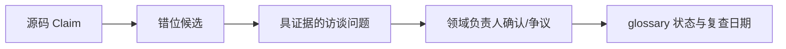

# 02 证据体系：技术来源与业务语义双轴

本篇适用于所有阶段。输入是 Claim、原始引用、环境记录和业务确认；产物是带技术证据类型、业务状态、provenance、新鲜度和验证任务的可审计论断。

## 一、技术证据按来源适配 Claim

| 类型 | 典型支持范围 | 必须记录 | 不能单独推出 |
|---|---|---|---|
| `source-verified` | 指定 commit 的声明、条件、静态边 | commit、file:line/配置、获取方式 | 目标环境启用或执行 |
| `build-verified` | 指定配置可构建、解析、装配 | 命令、环境、配置、原始输出 | 线上被调用 |
| `test-observed` | 测试/本地调试实际发生 | 测试 ID、环境、时间、输出 | 生产行为相同 |
| `runtime-observed` | 指定非生产环境观察 | 部署版本、窗口、采样、原始数据 | 生产分布相同 |
| `production-observed` | 指定生产环境和窗口观察 | 服务版本、窗口、采样率、聚合口径 | 窗口外不会发生 |
| `inferred` | 命名、结构、代理信号产生的候选 | 推理依据、置信度、验证方法 | 可作为决策事实 |
| `unverified` | 尚无适配支持 | 未知点、下一步 | 确定性结论 |

这些类型不是绝对强弱排名。例如，`source-verified` 最适合回答“代码写了什么”，`production-observed` 最适合回答“某版本在某窗口发生了什么”；后者也不能替代前者解释未采样分支。

历史 `verified` 默认映射为 `source-verified`。只有附有可审计的真实记录时，才能映射为 build/test/runtime/production observed；`inferred`、`unverified` 保持兼容。

## 二、业务语义是正交状态

业务轴使用 `pending`、`business-confirmed`、`disputed`、`stale`：

- `business-confirmed`：一位或多位具名确认人对声明范围内的含义达成确认；
- `disputed`：不同负责人、区域或产品版本存在冲突；
- `stale`：超过复查日期或适用范围发生变化；
- `pending`：仍待确认。

记录必须包含 `confirmed_by[]`、确认日期、适用范围、负责人和复查日期。源码能确认某函数写表，但不能确认这张表在组织语境中叫“结算”还是“对账”。争议不得由模型静默合并。

```yaml
- code_term: SettleService
  business_meaning: 实际处理渠道对账
  owner: finance-domain
  confirmed_by: [finance-owner, order-owner]
  confirmed_date: 2026-07-10
  applicable_scope: [order-service, cn]
  review_date: 2026-10-10
  status: business-confirmed
  evidence: src/main/java/com/acme/settle/SettleService.java:66
```

## 三、负面证据规则

“未搜索到”“测试未覆盖”“采样未出现”不能证明不存在。限定的负面结论必须同时具备：明确分母、可复现覆盖方法、环境与配置、时间窗口、已知盲区。缺少任一项时，写成“在本次范围内未观察到”，并保留验证任务。

因此：静态未引用只能产生删除候选；生产窗口无流量只能产生未观察候选；单次测试没走某分支不能证明不可达。

## 四、glossary 与错位探测

`glossary.yaml` 是人工事实源，机器不得覆盖。LLM 的角色不是凭命名解释业务，而是找出可向领域专家求证的错位：读方法有写副作用、注释与条件冲突、一个术语跨模块异义、职责溢出。访谈答案在 24 小时内回填，并设置复查日期。



## 五、追踪记录与新鲜度

追踪步骤逐条标记证据类型，不使用“真实调试 > 日志 > 源码”这种脱离 Claim 的总排名。记录环境、commit/部署版本、时间窗口、采样、引用和获取方式；预期输出不得冒充真实输出。

代码 commit、扫描配置、部署版本、业务规则、确认范围或复查日期变化时，证据应标为 stale 或重新采集。维护人与过期条件写入 `artifact-metadata.yaml`。只有关键 Claim 具备适配证据、业务冲突被显式保留、未知项有验证任务时，才能进入 Phase 3/4。
