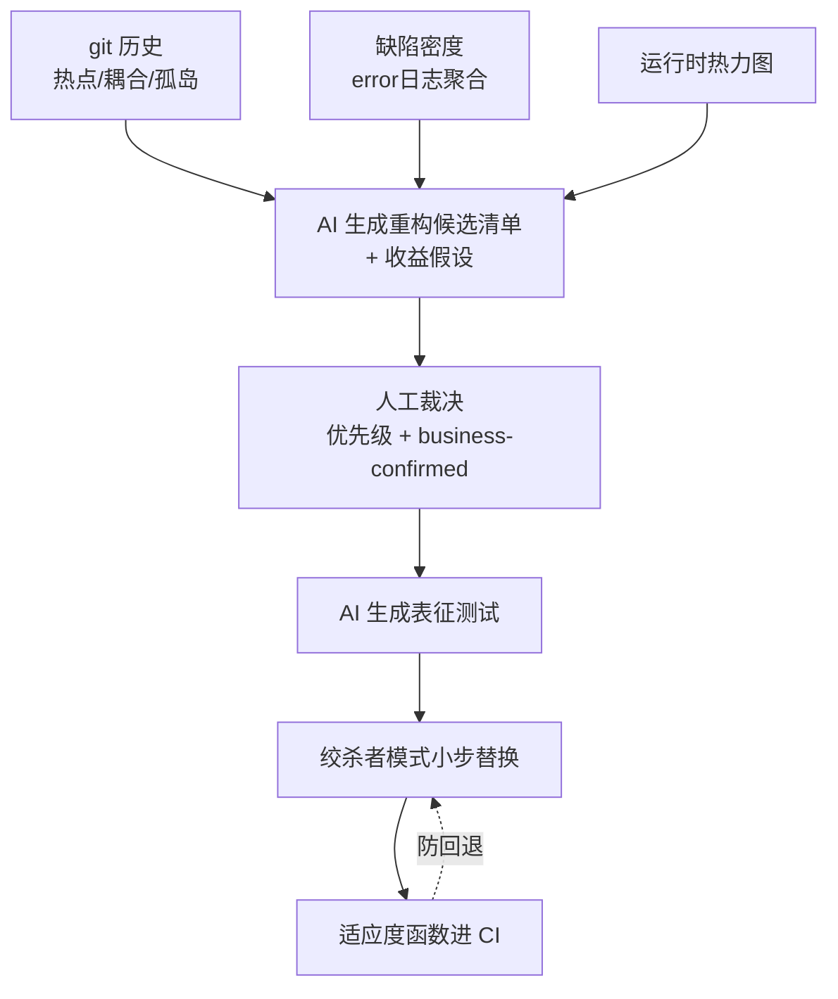

# 03 重构决策：方向从变更历史 × 业务演进算出来

核心主张：**重构方向不是从代码里读出来的，是从"变更历史 × 业务演进方向"里算出来的。** 代码本身只告诉你哪里丑，不告诉你哪里值得改。"让代码更干净"不是目标，不能作为任何重构的立项理由。

## 一、热点分析是第一优先级

用 git 历史挖掘，按 **变更频率 × 复杂度（圈复杂度或文件大小）** 排序，得到的热点才是重构 ROI 最高的地方：

- 一个复杂但三年没人动过的模块，重构它几乎是纯浪费；
- 一个每周都被改、每次改都出 bug 的 500 行函数才是真目标。

热点分析完全可以工具化（见 [04-工具箱设计.md](04-工具箱设计.md) 的 T1），并且可以叠加更多信号提高精度：

- error 日志聚合得到的**缺陷密度**（哪些模块历史上反复出问题）；
- 运行时热力图（哪些模块承载真实流量，见 [01-建图方法论.md](01-建图方法论.md)）。

AI 在热点清单之上的角色是**归因分析**："为什么这里频繁变更"——是需求本身多变，还是抽象切错了导致每个需求都要动它。前者不该动，后者才是重构目标。

## 二、抽象方向由变更轴线决定，不由品味决定

判断标准只有一条：**哪些需求会一起来，哪些代码就应该被一起改到；如果现状做不到，说明抽象切错了方向。**

具体操作，从 git 历史做变更耦合（co-change）分析：

- **找被切碎的概念**：如果两个相距很远的文件总是在同一个 commit 里被改，说明有一个隐含概念被切碎了——这就是抽象候选，应该把它们收拢到一起。
- **找承担多轴线的巨型模块**：如果一个文件在毫不相关的需求里都被改（典型如巨型 service），说明它承担了多个变更轴线，应该被拆。
- **不要为假设的未来做抽象**：抽象的依据必须是**已经发生过至少两三次**的变更模式，而不是"以后可能会支持多种 XX"。存量系统里最贵的债往往就是当年为不存在的未来做的抽象。

两种方法论立场的取舍：自底向上（跟着已发生的变更模式走）vs 自顶向下（AI 基于领域模型提出目标架构再倒推路径）。本方法论的立场是**自底向上为主**：AI 只出候选，人做裁决；目标架构可以作为远景参考，但每一步重构的立项依据必须是已发生的变更证据。

## 三、目标必须挂在指标上

可用的目标形态，按类别：

| 类别 | 指标示例 | 数据来源 |
|---|---|---|
| 交付类 | 某类需求的平均改动文件数、lead time | git 历史 + 需求系统 |
| 质量类 | 热点模块的缺陷密度、回归率 | error 日志聚合、bug 系统 |
| 认知类 | 新人上手时间；知识孤岛模块数（只有一两个人敢改的模块） | git 作者分布 |
| 架构类 | 明确依赖规则的违反数（如"domain 不得依赖 infra"） | 依赖图 + 适应度函数 |

知识孤岛值得单独强调：从 git 作者分布可以直接算出每个模块的 bus factor。一个热点模块如果同时是知识孤岛，它的风险是双重的——既频繁变更，又只有一个人能改。

## 四、人机分工

- **AI**：给定热点、耦合、缺陷密度数据，生成**重构候选清单 + 每项的预期收益假设**（改了它，预计哪个指标会动）；
- **人**：做优先级裁决，并对候选清单里的业务语义论断做 business-confirmed 确认（见 [02-证据体系.md](02-证据体系.md)）。

重构提案的最低证据门槛：热点/耦合数据（verified）+ 业务含义确认（business-confirmed）+ 预期收益假设（明确写出赌的是哪个指标）。三者缺一，提案退回补证据。

## 五、执行：绞杀者模式 + 表征测试

存量代码库大概率测试不足，直接改等于裸奔。执行永远走这个套路：

1. **AI 批量生成表征测试（characterization tests）**：锁定现有行为——不管行为对不对，先如实记录下来。写这种"记录现状"的测试人类觉得枯燥，AI 做得又快又好，这是 AI 杠杆最高的场景之一。
2. **绞杀者模式（Strangler Fig）小步替换**：新实现在旁边生长，流量逐步切换，旧代码逐步枯萎，任何一步都可回退。
3. **可观测性随重构增量生长**：替换某条链路时顺手把 tracing/指标埋进新代码（见 [01-建图方法论.md](01-建图方法论.md) 第五节），而不是重构前先做可观测性大工程。
4. **适应度函数守住成果**：重构方向确定后，把目标写成可执行断言（依赖规则、模块大小上限）进 CI，防止回退（见 [04-工具箱设计.md](04-工具箱设计.md) 的 T8）。

## 六、决策流程小结

