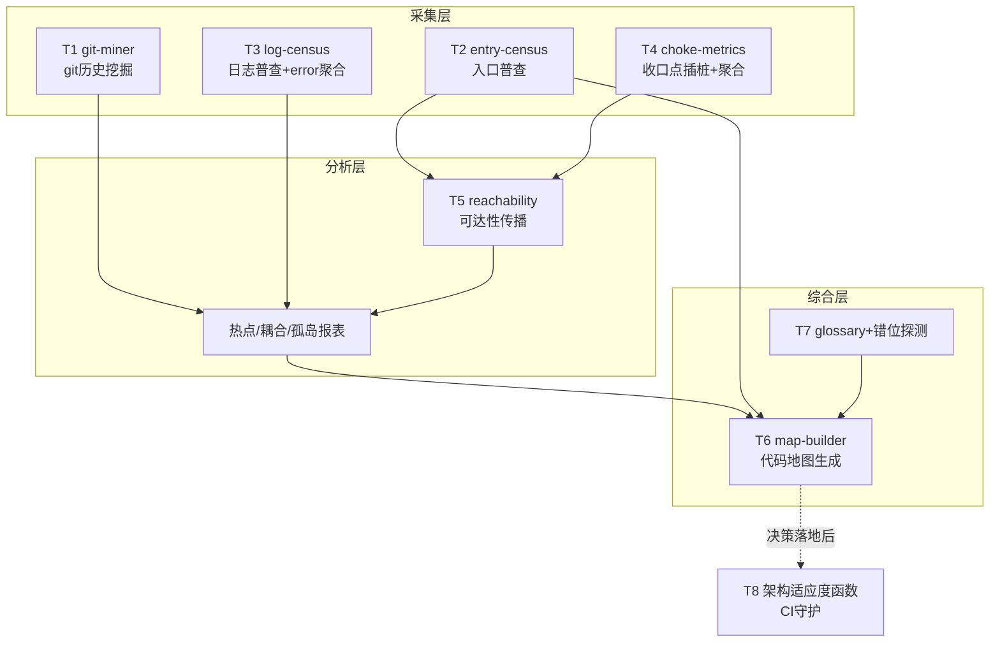

# 04 工具箱设计：T1–T8

把方法论固化为一组可组合的工具。设计原则先行：

1. **采集层确定性优先**：用 parser、git 挖掘、AST 工具，不用 LLM。LLM 只放在归因、摘要、错位探测这些模糊任务上，且必须回填 file:line 证据。
2. **产物纯文本进 git**：所有输出用 CSV/YAML/Markdown 存进仓库——人能 review diff，Agent 能直接当上下文读。
3. **机器段与人工段分离**：机器生成的内容可以随时重跑覆盖；人工确认的内容（business-confirmed 结论、glossary）用标记保护，重跑不清空。地图才能持续再生而不丢失人的投入。
4. **采集+分析层不依赖 LLM 也能跑**：LLM 坏了/贵了不影响数据积累；只有综合层是 LLM 密集的。

## 总览：四层结构与数据流

## T1 git-miner：git 历史挖掘

**输入**：git 仓库。**输出**三张 CSV：

| 文件 | 内容 |
|---|---|
| `hotspot.csv` | 文件 × 近 12 个月变更次数 × 复杂度得分 × 热点分 |
| `cochange.csv` | 总在同一 commit 出现的文件对，按关联规则式的 support/confidence 度量 |
| `ownership.csv` | 文件 × 作者分布 × bus factor（知识孤岛） |

**实现**：解析 `git log --numstat`，几百行 Python。复杂度第一版用 LOC 凑合，后接 lizard/tree-sitter。

**三个必须处理的坑**：

- **时间衰减**：一年前的变更权重应低于上月，否则历史久的文件永远霸榜；
- **巨型 commit 过滤**：一次动 200 个文件的格式化/迁移 commit 会污染耦合分析，按阈值剔除或降权；
- **rename 追踪**：否则改名文件的历史断裂。

T1 是普适性最强的工具：不依赖代码语言，对 commit message 质量也没要求（只看文件集合），零依赖、当天出结果。

## T2 entry-census：入口普查

**输出** `entries.yaml`：每个入口的类型（http/cron/mq/webhook）、路由或 cron 表达式或 topic、入口函数 file:line、声称用途。

**实现**：按技术栈写适配器——注解扫描、路由表解析、调度配置解析，大部分是确定性 AST/grep 工作；自研框架等奇怪注册方式让 LLM 兜底分类，但必须回填 file:line 证据。

**完备性校验**：拿 T4 的运行时数据反查——日志里出现过、清单里没有的入口，就是普查漏洞。

## T3 log-census：日志普查与 error 聚合

**静态侧**：AST 扫描所有日志语句，提取级别、消息模板、携带的业务键（业务键是穷人版 trace ID 的候选）。

**运行时侧**：对线上日志做模板聚类（Drain 这类日志模板挖掘算法），error 签名聚合后通过消息模板反向匹配回 file:line，得到**模块级缺陷密度**，喂给热点分析。

## T4 choke-metrics：收口点插桩

与其说是工具不如说是一个薄约定：在 web filter / 调度分发点 / consumer 基类各加一行结构化 JSON 日志（entry_id、耗时、结果），配一个小聚合脚本产出 `entry_weights.csv`。

**设计要点**：entry_id 必须和 T2 清单里的 ID 对得上，两边才能 join。

## T5 reachability：可达性传播

**输入**：`entries.yaml` + `entry_weights.csv` + 静态调用/依赖图。**输出**：模块热力图（模块热度 = Σ 可达入口的权重）。

这是技术风险最高的工具，关键取舍是**粒度**：

- 函数级调用图在动态分发、反射、依赖注入面前很不可靠；
- 第一版做**文件/模块级 import 图**——粗但稳健，排优先级够用；
- 图断掉的地方（反射、动态路由）显式标记 unverified，恰好是人工重点验证的清单；
- 函数级精化留到第二版，且只对热点模块做。

## T6 map-builder：代码地图生成

消费上面所有产物 + LLM 摘要，生成/更新 `notes/00-source-map.md` 和每模块一张卡片：职责、入口、热度、耦合对象、证据等级。

**核心设计决策：机器段与人工段分离**。机器生成段随时重跑覆盖；人工确认段（business-confirmed 结论、术语澄清）用标记保护。产出物是每次 Agent 会话的标准起始上下文。

## T7 glossary + 错位探测器

`glossary.yaml`（代码术语 ↔ 业务含义 ↔ 负责人 ↔ 确认日期）由人维护。错位探测器是 LLM 批处理任务，**只跑热点模块**（控制成本）：找命名与行为矛盾、注释与代码矛盾的点，输出访谈问题清单而非结论。访谈答案回填 glossary，glossary 注入所有 Agent 会话。详见 [02-证据体系.md](02-证据体系.md)。

## T8 架构适应度函数

把重构目标写成可执行断言进 CI：依赖规则（"A 层不得 import B 层"）、模块体积上限、热点分数回归检查。它是重构方向确定之后的守护工具，防止成果回退，最后做。

## 落地顺序

1. **T1**：零依赖、当天出结果，立刻能回答"哪里值得看"；
2. **T2 + T4**：静态骨架 + 运行时权重，这是地图有效性的根基；
3. **T5 → T6**：合成热力图和可再生地图，Agent 分析从此有了标准起始上下文；
4. **T3、T7** 与上面并行推进（T3 独立，T7 伴随访谈节奏）；
5. **T8** 等重构方向确定后再上。

Java/Spring 栈的具体落地细节（现成捷径和栈特有的坑）见 [05-Java-Spring落地指南.md](05-Java-Spring落地指南.md)。
