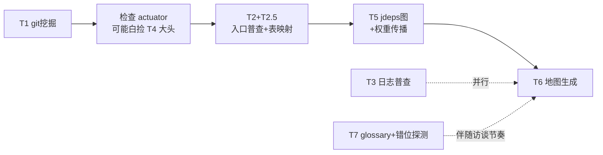

# 05 Java/Spring 落地指南

Java/Spring 栈对本方法论是好消息：静态类型加上 Spring 的"一切皆注解/配置"，让入口普查（T2）和可达性分析（T5）的可行性比动态语言高一大截，而且有几条 Java 独有的捷径。本篇按工具逐个给出栈特定的实现细节。

## T2 入口普查：注解扫描 + 运行时对账

静态侧按四类扫描：

| 类型 | 注册机制 |
|---|---|
| HTTP | `@RequestMapping` / `@GetMapping` 等注解；WebFlux 的 `RouterFunction`；老工程的 web.xml / servlet 注册 |
| 定时 | `@Scheduled`；Quartz 的 JobDetail/Trigger bean；xxl-job 的 `@XxlJob`；k8s CronJob manifest |
| MQ | `@KafkaListener` / `@RabbitListener` / RocketMQ 的 `@RocketMQMessageListener` 及各类 consumer 注册 |
| 事件 | `@EventListener`、`ApplicationListener` 实现类 |

用 JavaParser 或 tree-sitter-java 解析即可，**不需要工程能编译通过**——这对老旧存量工程很重要。

**Spring 特有的坑：条件装配。** `@Profile`、`@ConditionalOn...` 会让静态清单里的入口在生产环境根本不激活。对账办法：如果工程有 spring-boot-actuator，`/actuator/mappings` 直接给出**运行时真实生效的完整路由表**，和静态清单做 diff：

- 静态有、运行时没有 → 死入口（条件未激活或死代码）；
- 运行时有、静态没有 → 普查漏洞（动态注册、扫描器没覆盖的机制）。

这个对账本身就该做成工具的一部分。

## T4 收口点：先检查是不是白捡的

**Spring Boot 自带 Micrometer。** 如果 actuator 已引入，`http.server.requests` 指标**开箱就有**——HTTP 入口的频率、耗时、状态码分布不用写一行插桩代码。配个 prometheus endpoint，或干脆写脚本定期抓取 `/actuator/metrics` 即可。所以第一步永远是：检查 pom/gradle 里有没有 actuator，有的话 T4 的大头是白捡的。

需要手写的只剩两处，各一个类：

- 定时任务：一个环绕 `@Scheduled` 的 AOP 切面（记 entry_id、耗时、结果）；
- MQ 消费：consumer 拦截器（Kafka 的 ConsumerInterceptor / RabbitMQ 的 advice chain）。

**后手选项**：挂 SkyWalking 之类的 java agent（字节码插桩、零代码改动）一步到位拿到真 tracing。但这是运维决策，不作为分析的前置条件。

## T5 可达性：字节码分析比源码分析省事

第一刀直接用 **jdeps 对 jar 包做类/包级依赖图**——JDK 自带、基于字节码、不用自己写解析器。

**Spring DI 会打断朴素静态调用图**（按接口注入，实现类运行时才定），处理策略分级：

| 情况 | 策略 |
|---|---|
| 单实现接口 | 直接连边（占绝大多数，可靠） |
| 多实现接口 | 保守过近似：全连上，标记 uncertain |
| 反射、AOP 动态代理 | 显式断点，列入"待人工验证"清单 |

类级粒度对排优先级完全够用；函数级精化（Soot/WALA 这类重型工具）留到第二版，且只对热点模块做。

## Java 栈的两个额外红利

### 死代码检测几乎免费

JVM 加 `-verbose:class` 参数或用 JFR 记录类加载事件，生产跑一两个月，**从未被加载的类就是类级死代码候选**——不需要 JaCoCo 那种侵入式覆盖率。对存量系统这经常能划掉两位数百分比的代码。删除死代码是 ROI 最高的"重构"，而且它让后续所有分析的分母变小。

### T2.5：MyBatis/JPA 给你"数据表 ↔ 代码"地图

如果用 MyBatis，mapper XML 是可解析的：SQL 里的表名 ↔ mapper 接口 ↔ 调用方，一条链全是静态可得的；JPA 则从 `@Table` / `@Entity` 注解拿。产出一张矩阵：**每张表被哪些模块读、哪些模块写**。

这对重构决策价值极大，因为**拆模块/拆服务的真正硬约束往往不是代码依赖而是数据所有权**：一张表被五个模块直接写，代码层面拆得再干净也是假拆。表映射矩阵直接暴露这类问题，建议优先级排在 T2 之后立即做（故称 T2.5）。

## Java 版落地顺序

1. **T1**（git 挖掘，语言无关，当天出结果）；
2. **检查 actuator 现状**——决定 T4 是白捡还是要写切面/拦截器；
3. **T2 + T2.5**（入口普查 + 表映射普查，都是静态解析）；
4. **T5**（jdeps 类级依赖图 + 入口权重传播）；
5. **T6**（地图生成）；T3、T7 并行推进；T8 等重构方向确定后再上。
