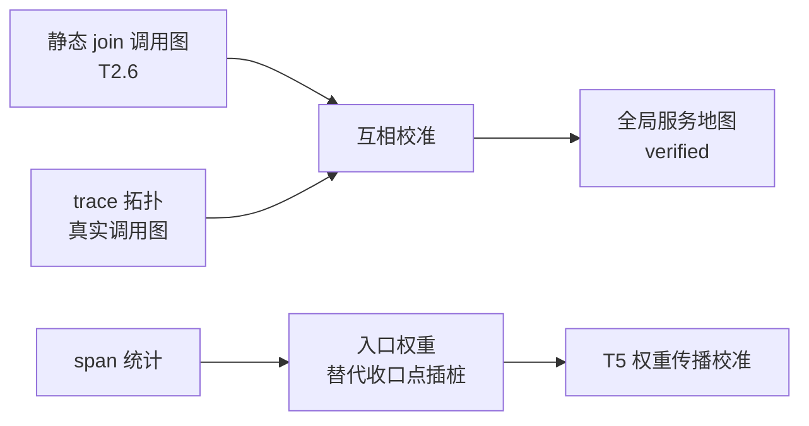

# 06 分布式与 Dubbo：跨服务的建图与 trace 方案

分布式调用让分析复杂化的本质是两点：**图跨了仓库**（单仓库可达性传播在服务边界断掉）、**运行时真相分散**（没有一个地方能看到完整调用链）。但 Dubbo 有个反直觉的好消息：**它比 HTTP 微服务更好分析**——Dubbo 的服务契约是强类型 Java 接口，而 HTTP 调用的 URL 经常是字符串拼出来的，静态分析几乎抓不住。

## 一、单服务内：入口/出口普查的扩展

- **入边**：`@DubboService`（老版本 `@Service`）注解和 `<dubbo:service>` XML 配置。provider 暴露的接口可枚举，纳入 T2 入口普查，与 HTTP/定时/MQ 并列为第四类入口。
- **出边**：`@DubboReference` / `<dubbo:reference>`。这是 T2 原来没有的概念——**出口普查**，单服务地图从此有了"我依赖谁"的静态边。

## 二、跨服务调用图（T2.6）：接口全限定名是天然的 join key

把所有仓库扫一遍，consumer 侧的 `@DubboReference`（接口 FQCN + version + group）和 provider 侧的 `@DubboService` 按签名 join，**纯静态就能拼出服务级调用图**，产出 `service-call-graph.yaml`。这是 Dubbo 强类型带来的红利，HTTP 微服务做不到这个精度。

两个坑：

- **version/group 必须参与匹配**，否则连错边；这俩经常写在 properties/yaml 甚至配置中心里，配置文件要纳入解析范围；
- **泛化调用（generic invocation）和跨语言调用是静态图的断点**，显式标 unverified。

**注册中心是白捡的运行时真相。** 这是分布式版的"actuator 对账"：Zookeeper/Nacos 里躺着运行时真实的 provider/consumer 注册关系（Dubbo Admin 可直接看）。静态 join 结果与注册中心 dump 做 diff：

- 静态有、注册中心没有 → 死引用（依赖声明了但没人提供，或服务已下线）；
- 注册中心有、静态没有 → 扫描漏洞（动态引用、泛化调用）。

不写任何插桩，先做这个对账，跨服务图的证据等级就从 inferred 升到 verified。

## 三、收口点：Dubbo Filter SPI

"分发点一次插桩"的分布式版：provider 端和 consumer 端各挂一个 Filter（SPI 机制，不改业务代码），一次性拿到所有 RPC 的频率、耗时、失败率、调用方标识，纳入 T4。

Dubbo 的 attachment 机制（RpcContext）还可以透传 correlation id——consumer Filter 塞进去、provider Filter 打出来，**穷人版分布式 trace**：不上全链路平台，先让跨服务日志能按 id join。注意：如果按第五节挂了自动埋点 agent，context 透传是免费的，这个穷人版方案可以直接退役。

## 四、真正变难的两件事

**跨仓库的变更耦合分析。** T1 的 co-change 靠"同一个 commit"，跨仓库天然失效。替代方案：commit message 里有需求/工单 ID 规范的，按工单 ID 做跨仓库 co-change；没有的，用发布时间窗口近似（总是同一批次上线的服务对）。这个信号非常值钱——**一个需求总要同时改 A、B 两个服务，就是服务边界切错了的铁证**，是微服务版的"被切碎的概念"（见 [03-重构决策.md](03-重构决策.md)）。

**跨服务数据所有权。** 分布式系统最恶劣的耦合不是 RPC 而是**共享数据库表**：两个服务直接读写同一张表，调用图上看似解耦，实际是假拆。T2.5 表映射必须在所有仓库上跑然后合并，"一张表被几个服务写"这一列是重构决策的硬约束。

## 五、trace 方案：自动埋点尽早上，手动埋点随重构生长

立场澄清："tracing 不是分析的前置条件"（[01-建图方法论.md](01-建图方法论.md)）针对的是**手工全链路埋点**——那是季度级工程。但 Java 栈有零代码方案，成本是周级，这笔账就变了。

### 三层决策

**1. 埋点层：统一面向 OpenTelemetry 标准（最重要的决策）。** 无论后端选什么，埋点 API 和数据协议（OTLP）都用 OTel，避免被任何一家 APM 锁死。落地方式是 **OTel Java Agent**：挂 `-javaagent` 参数，零代码改动，自动对 Spring MVC、Dubbo、JDBC、Redis、Kafka 等主流框架埋点；跨服务 context 透传（traceId 沿 Dubbo attachment / HTTP header）也是自动的。SkyWalking agent 能力相当，且新版本兼容接收 OTLP——埋点层选 OTel 标准不影响后端选 SkyWalking。

**2. 后端选型看运维能力，不看功能清单。** 要开箱即用的 UI 和存储选 SkyWalking（BanyanDB，国内生态成熟）；已有 Grafana 体系选 Tempo（对象存储、成本低）或 Jaeger。分析场景下都够用，别在选型上花太久——埋点层标准化后，后端随时可换。

**3. 采样策略决定成本和价值。** 存量分析最怕"出问题的那条 trace 恰好没采到"，推荐 **tail-based sampling**（OTel Collector 的 tailsampling processor）：**错误全采、慢请求全采、正常流量低比例采样**。比头部采样贵（collector 要缓存完整 trace 再决策），但对"用 trace 定位痛点"的场景价值完全不同。

### 两个让 trace 值钱十倍的细节

- **日志关联**：logback/log4j2 的 MDC 注入 traceId（agent 自动做），日志和 trace 双向跳转——logs-only 状态下积累的存量日志立刻升值；
- **业务键进 span attributes**：订单号、用户 ID 放进 attributes，打通"业务问题 → trace"的查询路径。这部分需要少量手动埋点，正好放在重构时顺手做（与"可观测性随重构增量生长"一致）。

### 增量落地路径

1. 从热力图选**最热的 3-5 个服务**先挂 agent（灰度友好：运维层决策，按服务逐个上）；
2. Collector + tail-based 采样 + 轻量后端（Jaeger all-in-one 或 Tempo 起步）；
3. MDC 日志关联打通；
4. 重构新代码里手动补业务 span 和业务键 attributes。

### 与方法论的闭环

trace 跑起来之后，它反过来成为地图的 ground truth：

静态分析先行、trace 后到、互相验证——静态图的断点（泛化调用、反射）由 trace 补全，trace 采样漏掉的低频路径由静态图兜底。

## 六、对工具箱的影响汇总

| 工具 | 变化 |
|---|---|
| T2 | 新增 Dubbo 入边（`@DubboService`）和出边（`@DubboReference`）普查 |
| T2.5 | 表映射跨仓库合并，输出"表 × 服务"读写矩阵 |
| T2.6（新增） | 跨服务调用图：全仓库静态 join + 注册中心对账 |
| T4 | 新增 Dubbo provider/consumer Filter 两个收口点；挂 OTel agent 后可由 span 统计替代 |
| T5 | 权重传播升级为全局：入口流量沿 RPC 边跨服务下传 |
| T1 | 跨仓库 co-change 需借助工单 ID 或发布窗口近似 |

整体框架不变，图多了一层。
