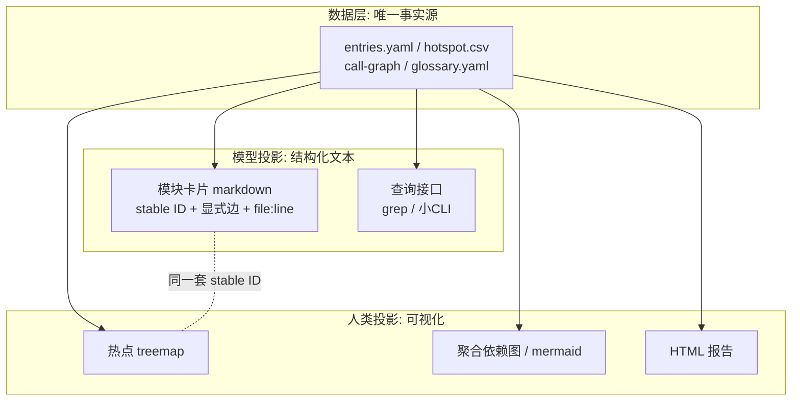

# 07 面向人与模型的表示：一份数据、两个投影

人和模型需要的表示形式确实不同：人更多依赖可视化，模型更多依赖结构化的、便于工具处理的文本。但正确的设计**不是维护两种结构，而是"一份数据、两个投影"**——如果人看的图和模型读的结构是两套各自维护的东西，它们一定会漂移，最后两边都不可信。

## 一、从两类消费者的失效模式倒推设计

设计表示形式之前，先明确人和模型各自"败"在哪里：

**人的失效模式是规模和细节。** 人擅长空间关系、格式塔感知（一眼看出聚类、离群点）、颜色/大小编码，但装不下 500 个节点的图。所以人的视图必须做**聚合和渐进披露**：overview first, zoom and filter, details on demand（Shneiderman 的可视化箴言）。典型形态：热点 treemap（面积 = 代码量、颜色 = 变更频率）、模块级依赖图（不是类级）、分层的 C4 图。

**模型的失效模式是空间推理、时效和幻觉。** 模型读不了渲染后的像素布局（多模态也远不如读文本可靠），但能吞下人读不动的大量线性文本；它需要的是**稳定锚点和显式语义**：stable ID、显式的边（谁依赖谁写成三元组，而不是靠图上的箭头）、每个论断带 file:line 证据、可 grep 可 join 的格式。

有趣的推论：**两边其实都需要"渐进披露"，差别只是渲染模态**。人是"缩略图 → 点开看详情"，模型是"摘要卡片 → 按需读明细文件"——这正好和 T6 地图的"每模块一张卡片"设计对上了。

## 二、三层架构：数据层 → 模型投影 → 人类投影

**数据层是唯一事实源**：T1–T5 的产物（CSV/YAML）就是这一层，机器生成、可重跑。两个投影都从它派生。**永远不要手绘架构图**——手绘图从画完那一刻就开始腐烂（diagram rot），这是存量系统文档不可信的头号原因。图必须是"编译"出来的：代码变了，重跑就更新。

### 模型投影的设计要点

- **stable ID 贯穿一切**：entry_id、module_id 在卡片、CSV、图里是同一个。模型才能跨文件 join，人在图上看到的节点才能对应到模型的结论。
- **完整但不塞进 context**：全量调用图可能几万条边，不要 dump 给模型，而是让它能查——grep 一个规整的 YAML 通常就够了；更进一步是一个小 CLI（`map query --module xxx`）。
- **显式语义优于隐式布局**：模型层的"依赖"是 `from/to/type/evidence` 四元组，不是箭头。
- **带证据和证据等级**：与 [02-证据体系.md](02-证据体系.md) 直接衔接，每条论断可溯源。

### 人类投影的设计要点

- **默认聚合到模块级**：超过约 50 个节点的图对人就是噪音。
- **用视觉通道编码分析结论**：面积 = 规模、颜色 = 热度/缺陷密度、边粗细 = 调用量——让"哪里值得看"变成一眼可见。
- **交互优先于静态**：treemap 下钻、依赖图按需展开，比一张全量大图有用得多。可借力 CodeCharta 这类现成工具，不必自研渲染。

## 三、双读格式：杠杆最高的中间地带

有一类格式人和模型都能直接消费，应该优先用：

| 格式 | 人怎么读 | 模型怎么读 |
|---|---|---|
| mermaid | 渲染后的图 | 文本即结构，能读能写 |
| markdown 表格 | 短枚举一目了然 | 行列结构直接解析 |
| 带注释的 YAML | 读 comment | 解析 key |

mermaid 尤其值得强调：它天然免疫 diagram rot，因为它本身就是从数据生成的文本。

**双读格式的适用边界就是规模**：小到一屏（约 50 节点以内）用双读；大了必须分叉成"模型查询接口 + 人的交互式可视化"两条路。热点 top-20、入口清单这类短枚举永远适合双读。

## 四、落到工具箱上：T6 的输出端规格

这套思路本质上是给 T6 map-builder（见 [04-工具箱设计.md](04-工具箱设计.md)）补充输出端规格。输入不变（T1–T5 产物），输出细化为三层：

1. **数据层**（已有）：CSV/YAML 事实源；
2. **模型层卡片**（已有，补规范）：stable ID、显式边四元组、证据等级；
3. **人类层渲染**（新增）：mermaid 生成 + treemap/HTML 报告。

两条铁律：

- **生成顺序永远是 数据 → 模型文本 → 人类渲染**，反向禁止——不允许人在图上改了不回写数据；
- 人工确认的内容（business-confirmed、glossary）只存在于数据层的人工段，两个投影都从那里读取，保证人和模型看到同一份业务真相。
