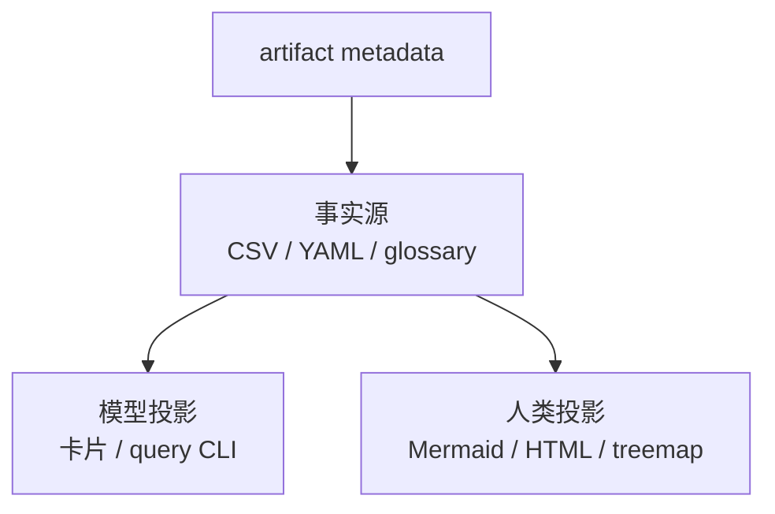

# 07 面向人与模型的表示：事实源、stable ID 与投影

本篇适用于所有产生长期地图的阶段。输入是带 metadata 的 CSV/YAML/人工事实；产物是查询友好的模型投影和可读的人类投影。核心边界：投影可重建，不反向覆盖事实源。

## 一、一份事实，多种投影

人需要聚合、筛选和渐进披露；模型需要 stable ID、显式边、证据引用和按需查询。全量图不要一次塞进上下文，使用“摘要 → 查询 → 证据”的工作集。

## 二、artifact provenance

每个事实源记录工具/规则版本、commit、扫描范围、配置摘要、环境、窗口、采样、负责人和过期条件。CSV 使用同名 `.metadata.yaml` 侧车。投影展示来源 revision 和生成时间，避免用户把旧图当成当前事实。

## 三、stable ID 的 alias 与 lineage

路径不是永久 ID。移动、重命名、拆分、合并和跨仓迁移时记录：

- `aliases`：历史或外部名称；
- `previous_id`：直接前身；
- `lineage`：rename/split/merge/move 的原因与目标；
- 生效 commit 与日期。

不得用新路径静默覆盖旧 ID，否则 revision、Claim、图和人工确认无法可靠 join。

## 四、探索图与事实图

手绘图在探索、访谈和白板讨论中是允许且有价值的，但必须明确标记 `exploratory`、作者、日期和待验证点。它不能成为事实源或覆盖机器账本。经验证的节点/边应回填数据层，再重新生成正式投影。

Mermaid、Markdown 表和带注释 YAML 适合小规模双读；大型图使用查询接口和交互式视图。颜色不能单独表达状态，文本同时显示证据类型、业务状态和 stale 状态。

## 五、安全与阶段门

模型投影遵守 `analysis-policy.yaml`：排除敏感路径，脱敏日志和业务标识，限制远程模型可见数据。人类 HTML 也应默认本地生成并转义模型文本。

事实源、metadata、stable ID 和维护人齐备后才能进入长期地图；投影不能推出源数据之外的完整性。commit、配置、窗口或 lineage 变化时重建投影并标记旧版本过期。
