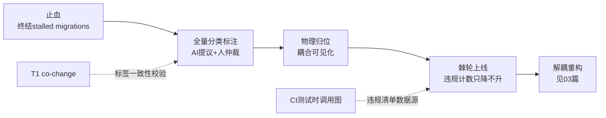

# 08 梳理阶段实战：来自 Shopify 与 Slack 的经验

巨构代码库的改造，最难的往往不是重构本身，而是重构之前的**梳理阶段**。本篇吸收两个公开案例的经验——Shopify 把最大的 Rails 单体演化为模块化单体（Componentization / Wedge），Slack 移动端的 Stabilize → Modularize → Modernize（Project Duplo）——并把它们接到本方法论的工具箱上。

案例出处：

- Shopify: [Deconstructing the Monolith](https://shopify.engineering/deconstructing-monolith-designing-software-maximizes-developer-productivity)
- Slack: [Stabilize, Modularize, Modernize: Scaling Slack's Mobile Codebases](https://slack.engineering/stabilize-modularize-modernize-scaling-slacks-mobile-codebases/)

## 一、核心重构：梳理不是"理解任务"，而是"分类任务"

Shopify 案例最容易被忽略的细节：他们把 **6000 个 Ruby 类列进一张大表格，人工逐个标注归属组件**（orders / shipping / billing / inventory……）。这就是梳理阶段的本质——**给每个代码单元贴归属标签**。

你不需要深度理解每个类的实现，只需要回答"它属于哪个业务概念"。把梳理从"读懂全部代码"重构成"完成一次全量分类"，难度立刻从不可能变成可管理：

- 有明确的**分母**（6000 个类），进度可计算；
- 可**并行**（不同人/不同 Agent 标注不同区域）；
- 有明确的**完成态**（每个单元都有标签）。

前置条件是先立**标签体系**：目标组件清单来自业务概念而非技术层次（不是 model/view/controller，而是订单/运费/计费），由各领域干系人共同给出，数量控制在几十个以内。

**AI 改变了这个游戏的成本结构。** Shopify 2017 年靠人肉标注 6000 个类；今天 LLM 可以批量提议标签，每条附**置信度 + 证据**（为什么归它：调用了谁、被谁调用、操作哪些表），人只仲裁低置信度和有争议的部分——这正是 [02-证据体系.md](02-证据体系.md) 双轴分工的直接应用。另外 T1 的 co-change 数据可以做**标签一致性校验**：总在一起变更的文件应该大概率同标签，违反的地方要么标签标错了，要么就是真实的架构问题——两种都值得看。

## 二、三条案例经验，对应梳理的三个难点

### 1. 先归类让耦合暴露，而不是先解耦（Shopify）

Shopify 做的第一件事不是解依赖，而是一次 big-bang PR 把全部文件按业务概念重新排目录——**零逻辑改动、纯文件移动、自动化脚本生成**，靠完备的测试套件兜底。目的只有一个：**归类之后，跨组件的调用从"看不见"变成"扎眼"**。

梳理难的一大原因是耦合不可见。物理归位是最便宜的可见化手段——先让代码的"住址"反映业务归属，违规调用自然浮出水面，解耦才有了靶子。

代价他们也如实记录了：git 历史被文件移动打断（GitHub 把 rename 当成删除+新建）。这正好印证 T1 里"rename 追踪"那个坑——做 git 挖掘时必须用 `--follow` 或等价机制跨越这类大迁移。

### 2. 先止血，再梳理（Slack 的 Stabilization 阶段）

Slack 把改造顺序定为 Stabilize → Modularize → Modernize，第一阶段整整六个月只干两件事：

- **终结所有半途而废的迁移**（Objective-C → Swift、直连 CoreData → 数据访问库、第三方网络库 → 自研库）；
- **把"同一件事的 N 种写法"收敛成一种**（"Instead of multiple ways to do the same thing, we had a single correct way"）。

这条对梳理的意义极大：当代码库里同一件事有三种写法时，任何自动化扫描、归类、分析的成本都要乘三。**一致性是梳理的前提条件，不是梳理的结果。** 存量系统里的 stalled migration 是隐形的分析税——梳理启动前先盘点未完成迁移清单，能收尾的收尾，不能收尾的至少冻结（禁止新代码使用旧模式）。

Slack 还证明了顺序的另一层价值：Stabilization 先出成果，向组织证明了整个项目能成，为后面更有野心的阶段挣到了持续投入。

### 3. 梳理必须有燃尽图（两家共同做法）

没有数字，梳理就永远处于"快梳理完了"的状态，资源随时会被抽走。两家都用了技术上极简单、组织上决定性的手段：

- **Slack**：自动脚本数"剩余废弃模式数量"（剩余 Objective-C 文件数、废弃方法调用数），配 dashboard 和 deadline，落后了就重新调配资源；
- **Shopify**：自研 Wedge 工具，给每个组件算**隔离得分**、列**违规清单**（跨组件的非公开 API 调用、跨组件的 ActiveRecord 关联、跨组件继承），看趋势。

度量脚本本身是 grep 级的工作量，但它把梳理从"感觉上的进展"变成"可问责的进展"。这类"违规计数 + 趋势"本质上就是 T8 适应度函数的雏形。

## 三、CI 测试时调用图：第三条数据采集路

Wedge 的调用图既不是静态分析出来的，也不是生产 trace，而是 **CI 跑测试套件时挂 Ruby tracepoint 采集的**。这是介于两者之间的第三条路：

| 途径 | 真实性 | 风险/成本 | 覆盖 |
|---|---|---|---|
| 静态分析 | 过近似（动态分发处断裂或虚连） | 零风险 | 全量 |
| CI 测试时采集 | 真实执行的调用边 | 零生产风险，CI 每次自动更新 | 受测试覆盖率限制 |
| 生产 trace | 最真实 | 需要部署 agent，运维决策 | 受采样和流量限制 |

Java 栈完全可复制：测试运行时挂 agent 或 AOP 采集跨模块调用边。它作为 T5 可达性分析的补充数据源特别合适——静态图连不上的地方（反射、DI 多实现），测试时调用图可以补上真实的边；且它的新鲜度由 CI 保证，不会腐烂。局限也要标注清楚：**测试没覆盖到的路径它看不见**，所以它验证的边是 verified，但缺失的边不能推断为"不存在"。

## 四、治理面：梳理边做边有人往里扔新代码怎么办

两家的答案高度一致：

- **专职团队**：Slack 的 core team 明确不被抽去做功能开发；梳理不能是"大家有空时做的事"。
- **棘轮机制**：违规数只许降不许升。Wedge 分数进趋势图、Slack 的废弃模式计数配 deadline——等价于把 T8 适应度函数的"不许恶化"版**在梳理期提前上线**，不等重构方向定了才上。存量违规先豁免（baseline），新增违规 CI 直接拦。
- **对上用数据拿授权**：Slack 给管理层的提案三件套值得照抄——(1) 数据支撑的痛点（构建时长、测试失败率、迁移进度、开发者定性反馈）；(2) 进度度量方案（先说清楚怎么衡量成功）；(3) **各阶段失效模式预判**（预先写清楚每个阶段最可能怎么失败、如何缓解——技术风险和组织风险都算）。第三条最少见也最值钱：它把"项目可能烂尾"从隐忧变成被管理的对象。

## 五、接回本方法论

梳理阶段的完整序列：**止血 → 分类标注 → 物理归位 → 棘轮上线 → 进入重构**。它填补了本方法论中"评估"和"执行"之间的空档——热点和耦合数据告诉你哪里值得改（[03-重构决策.md](03-重构决策.md)），但对巨构代码库，改之前先要有一轮组件归属的全量梳理，本篇就是这一轮的操作手册。
