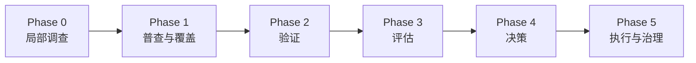

# 存量大型代码库分析方法论

这套方法论帮助团队在**声明的仓库、commit、环境和时间窗口内**建立可追溯认识，并在证据足够时支持评估与改造决策。它不承诺自动读懂全部系统，也不把源码分析、代理指标或外部案例直接当成重构依据。

第一次使用请从 [00 方法论边界与阶段门](00-方法论边界与阶段门.md) 开始。它定义本仓库统一的阶段、证据类型、适用边界和退出条件；其余篇章是各阶段的操作细则。

## 六阶段总览



| 阶段 | 回答的问题 | 核心产物 |
|---|---|---|
| Phase 0 局部调查 | “这条链路/这个现象在源码中如何组织？” | Claim、源码引用、候选链路、未决项 |
| Phase 1 普查与覆盖 | “声明分母内找到了什么，还漏了什么？” | 仓库/入口/资产清单、coverage ledger |
| Phase 2 验证 | “在指定环境和窗口中实际发生了什么？” | 构建、测试、调试、日志或 trace 记录 |
| Phase 3 评估 | “哪些风险或候选值得继续验证？” | 独立信号、口径、不确定性和验证任务 |
| Phase 4 决策 | “是否值得立项，收益假设是什么？” | 三道门槛、基线、目标、裁决记录 |
| Phase 5 执行与治理 | “是否已准备好安全迁移，结果是否达标？” | readiness、发布/回退、观测和 CI 棘轮 |

采用规模不必一刀切：**快速调查**只做 Phase 0，**标准评估**做到 Phase 3，**完整改造**才进入 Phase 4–5。默认从前两档开始。

## 核心纪律

1. **证据适配 Claim**：使用 `source-verified`、`build-verified`、`test-observed`、`runtime-observed`、`production-observed`、`inferred`、`unverified`，不把它们误写成脱离场景的单一强弱排名。
2. **业务语义是正交轴**：`pending`、`business-confirmed`、`disputed`、`stale`；确认必须具名、限定范围并设复查日期。
3. **没有观察到不等于不存在**：负面结论必须给出分母、覆盖方法、环境、时间窗口和盲区。
4. **代理指标只负责排序调查**：`error-signal density`、`ownership concentration proxy`、`reachability-weighted exposure estimate`、`change-coupling signal` 不能单独立项。
5. **确定性采集优先**：parser、AST、git 和运行记录负责采集；LLM 负责候选归因、摘要和错位探测，并回填证据引用。
6. **产物可追溯且会过期**：机器产物记录工具版本、commit、范围、配置、窗口、负责人和过期条件；人工段不能被重跑覆盖。

历史 `verified` 仅为兼容保留，默认解释为 `source-verified`；没有真实运行记录时不得升级为 observed 类型。

## 文档索引

| 文档 | 阶段与用途 |
|---|---|
| [00-方法论边界与阶段门.md](00-方法论边界与阶段门.md) | 全局边界、Phase 0–5、证据词汇、三档采用方式 |
| [01-建图方法论.md](01-建图方法论.md) | Phase 0–2：静态候选、覆盖账本和运行校准 |
| [02-证据体系.md](02-证据体系.md) | 全阶段：技术/业务双轴、负面证据、新鲜度与争议 |
| [03-重构决策.md](03-重构决策.md) | Phase 3–5：独立信号、三道门槛和 readiness |
| [04-工具箱设计.md](04-工具箱设计.md) | T1–T8 的输入输出、provenance 和 Phase 0 交接 |
| [05-Java-Spring落地指南.md](05-Java-Spring落地指南.md) | Java/Spring 的扫描、观测和工具边界 |
| [06-分布式与Dubbo.md](06-分布式与Dubbo.md) | RPC 对账、trace 采样、隐私和协议断点 |
| [07-面向人与模型的表示.md](07-面向人与模型的表示.md) | stable ID、lineage、机器事实源与人类投影 |
| [08-梳理阶段实战.md](08-梳理阶段实战.md) | Shopify/Slack 案例事实、推论与本地采用条件 |
| [09-多仓库联合分析.md](09-多仓库联合分析.md) | 声明分母、跨仓模糊 join 与验证任务 |
| [10-Code-Loop与Phase0契约差距.md](10-Code-Loop与Phase0契约差距.md) | 当前 Phase 0 能力、方法论解释与未来实现差距 |

每篇都应明确：适用场景、输入、产物、能推出什么、不能推出什么、下一阶段门槛，以及维护人与过期条件。

## 模板与工具

[templates/](templates/README.md) 提供 16 个基础模板与示例侧车，包括 provenance、分析策略、覆盖账本、需求信号、入口/API 边、trace、术语、资产、模块卡片、指标基线和重构提案。CSV 产物使用同名 `.metadata.yaml` 侧车。

`.cursor/skills/` 中的 `git-hotspot-mining`、`entry-census`、`asset-labeling`、`mismatch-detection`、`cross-repo-mapping` 将 T1/T2/跨仓分析固化为可复用流程。工具结果仍受 [00 总控篇](00-方法论边界与阶段门.md) 的阶段边界约束。

## Code Loop：Phase 0 局部调查工具

`code-loop` 从一个自然语言问题出发，用受限只读工具形成源码 Claim、证据引用、候选链路和未决项。它是 **Phase 0 的调查辅助工具**：产物是候选知识和 Phase 1/2 的输入，不自动晋升为 glossary、入口账本、线上事实或重构依据。

```bash
python -m venv .venv
.venv/bin/pip install -e '.[dev]'
export DEEPSEEK_API_KEY='...'
code-loop                       # 选择 workspace，进入 Dashboard
code-loop /path/to/repository   # 指定 workspace
code-loop start /path/to/repository "梳理订单创建请求的调用链"
```

工作台有六个任务视图：**Overview、Graph、Claims、Evidence、Activity、Revisions**。使用 `1–6` 或 Tab 切换，`Ctrl+P` 打开命令面板，`/` 过滤，`Ctrl+R` 继续分析，`F10` 聚焦内容，`m` 打开本地 Mermaid HTML。Claim 支持 `c/x/e` 裁决，Evidence 支持 `y` 复制引用、`o` 用 `$EDITOR` 打开。

会话以一个主调查问题为边界，宽问题拆入议程，成功分析形成不可变 revision。`analysis.json` 是当前快照；`report.md`、`journey.mmd`、`report.html` 是可再生产物。当前 Code Loop 的 `verified` 仅按兼容规则解释为 `source-verified`；实现差距见 [Code Loop 与 Phase 0 契约差距评估](10-Code-Loop与Phase0契约差距.md)。

配置示例见 [code-loop.toml.example](code-loop.toml.example)。磁盘时间使用 UTC，Dashboard/Activity 转成本地时间；本地 HTML 使用随包分发的 Mermaid，不依赖远程图表服务。

## 在线演示

方法论概览：https://makotogu.github.io/codebase-analysis-methodology/

本地可打开 [docs/index.html](docs/index.html)。演示页是辅助投影，正文和模板才是方法论事实源。
