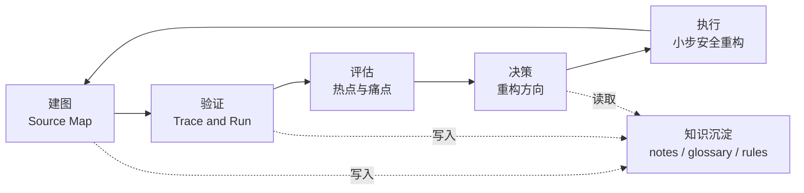

# 存量大型代码库分析方法论

这套文档回答一个问题：**面对一个巨大的、缺少文档的、只有分散日志的存量系统，如何用 AI/Agent 辅助把它分析清楚，并据此决策重构方向。**

它不是阅读技巧合集，而是一套证据驱动的工程方法：每个环节都有明确的产出物、证据等级和人机分工。

## 两大失败模式

方法论的设计首先是为了对抗两种最常见的失败：

1. **漫游式阅读**：从随机文件点进去，深度优先陷进细节，一周后什么也没沉淀。大型代码库 80% 的代码和你当前关心的问题无关，没有地图的阅读注定迷路。
2. **AI 幻觉式总结**：让 LLM 概括架构，得到一份看似合理但没有任何文件路径支撑的文档。AI 会顺着命名编故事，而存量系统的命名恰恰经常和业务实际对不上。

对抗前者靠**建图**，对抗后者靠**证据等级**。

## 总框架：证据驱动的循环

- **建图**：静态骨架（模块边界、入口清单）+ 运行时数据加权（流量、频率、失败率），产出带证据等级的代码地图。
- **验证**：对关键路径用运行时证据（日志、断点、真实输出）校准静态阅读的推演。
- **评估**：热点分析、变更耦合、缺陷密度、知识孤岛，算出哪里值得改。
- **决策**：重构方向不是从代码里读出来的，是从"变更历史 × 业务演进方向"里算出来的。
- **执行**：绞杀者模式 + 表征测试，小步替换，可观测性随重构增量生长。

## 核心原则

1. **证据驱动**。每个架构论断都标注证据等级（verified / inferred / unverified），没有文件路径支撑的描述一律视为假设。代码事实和业务语义是两个正交的轴，后者只能由人确认。
2. **笔记是一等公民**。Agent 没有记忆，沉淀的笔记（地图、术语表、追踪记录）本身就是下一轮分析的上下文，是方法论的核心资产而非副产品。
3. **以流为锚点，不以文件为锚点**。永远围绕一条端到端的可观察旅程（一个请求、一条 SQL、一个定时任务）组织阅读和验证，控制认知负担。
4. **先榨干已有信号，再谈补埋点**。存量系统躺着大量可挖的数据（access log、error 日志、慢查询、git 历史），改代码的插桩只在收口点做。
5. **确定性优先，LLM 只做模糊任务**。采集和分析用 parser 和 git 挖掘，LLM 放在归因、摘要、错位探测这些模糊任务上，且必须回填路径证据。

## 文档索引

| 文档 | 内容 |
|---|---|
| [01-建图方法论.md](01-建图方法论.md) | 静态骨架 + 运行时加权；后台任务盘点；logs-only 状态的四步走 |
| [02-证据体系.md](02-证据体系.md) | 代码事实 / 业务语义双轴证据等级；术语对照表；AI 作为错位探测器 |
| [03-重构决策.md](03-重构决策.md) | 热点分析；抽象方向由变更轴线决定；目标指标；绞杀者模式执行 |
| [04-工具箱设计.md](04-工具箱设计.md) | T1–T8 工具设计、数据流、设计原则与落地顺序 |
| [05-Java-Spring落地指南.md](05-Java-Spring落地指南.md) | Java/Spring 栈的具体落地：注解扫描、actuator 对账、jdeps、表映射 |
| [06-分布式与Dubbo.md](06-分布式与Dubbo.md) | 跨服务调用图、注册中心对账、跨仓库耦合分析、OTel trace 方案选型 |
| [07-面向人与模型的表示.md](07-面向人与模型的表示.md) | 一份数据两个投影：人类可视化与模型结构化文本的分层设计 |
| [08-梳理阶段实战.md](08-梳理阶段实战.md) | 梳理即分类、先止血再归类、燃尽度量、棘轮治理（Shopify/Slack 案例） |

建议阅读顺序即编号顺序：先理解怎么建图和怎么控制证据质量，再看怎么做重构决策，最后是工具化和栈特定细节。

## 在线演示

方法论概览幻灯片（GitHub Pages）：https://makotogu.github.io/codebase-analysis-methodology/

本地预览：在浏览器中打开 `docs/index.html`。使用 ← → 或空格翻页。

**首次启用 Pages**（仓库管理员一次性操作）：进入仓库 **Settings → Pages**，将 **Build and deployment → Source** 设为 **Deploy from a branch**，Branch 选 `gh-pages` / `/ (root)`，保存后等待 1–2 分钟生效。
